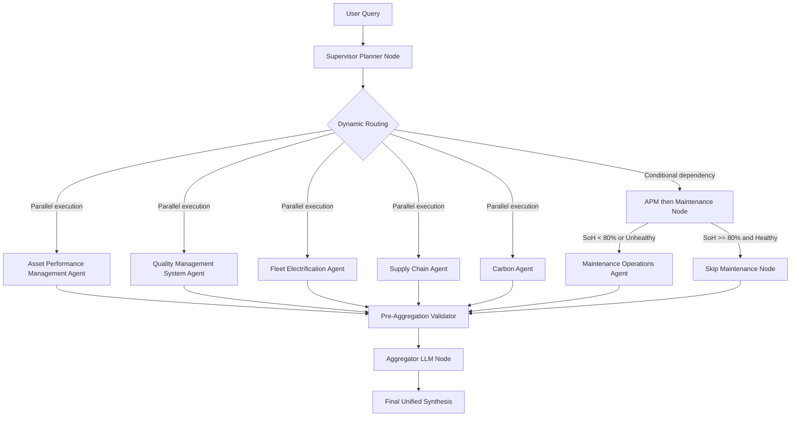

# 🔋 EV Fleet Intelligence & Supply Chain AI Platform

An enterprise-grade, multi-agent AI orchestration platform designed to manage electric vehicle (EV) asset performance, factory manufacturing quality (QMS), fleet electrification transitions, workshop maintenance scheduling, charging infrastructure planning, green logistics carbon footprint, and supply chain risk profiling. 

The platform features a **LangGraph-driven central Supervisor Orchestrator** that coordinates six specialized sub-agents, executing deterministic query parsing, parallel sub-graph execution, dependency-driven routing, and strict data validation layers.

---

## 🏗️ Architecture Overview

The system operates as a hierarchical multi-agent state graph. The central supervisor functions as an intelligent dispatcher and synthesizer, delegating query analysis to specialized domain agents before combining their outputs into unified executive findings.



---

## 🤖 The Multi-Agent Ecosystem

Each agent is designed as an isolated, stateful sub-graph (powered by LangGraph) with its own query planner, specialized toolset, LLM reasoning node, and template fallback handler.

### 1. Asset Performance Management (APM) Agent
* **Purpose**: Performs real-time battery degradation and thermal safety diagnostics.
* **Core Capabilities**: Computes State of Health (SoH), predicts Monthly Degradation Rates, estimates Remaining Useful Life (RUL), detects thermal runway risks, and generates charging warning triggers.
* **Sensor Input Mapping**: Processes average/maximum operating temperatures, charge durations, and deep discharge cycles.

### 2. Quality Management System (QMS) Agent
* **Purpose**: Governs manufacturing cell quality and process stability.
* **Core Capabilities**: Evaluates factory scrap rates, isolates defect categories (e.g. weld defects, impurities, casing deformation), tracks parameter drift, and triggers corrective action alerts (SCAR).
* **Telemetry Analytics**: Monitors electrolyte volume (ml), internal cell resistance (mΩ), and target capacity (mAh).

### 3. Supply Chain & Logistics Risk Agent
* **Purpose**: Audits raw material provenance, ESG mineral compliance, and geopolitical supply bottlenecks.
* **Core Capabilities**: Maps complete traceability lineages from mineral mining to refinery batches, cell QC, battery pack assembly, and final vehicle VINs. Evaluates composite supplier risk across Geopolitical, Dependency, and Quality vectors.
* **Strict Validation Layer**: Evaluates metrics through a metric validation layer to resolve duplicate or conflicting values, ensuring every numerical claim aligns with raw tool outputs.

### 4. Fleet Electrification & Sourcing Agent
* **Purpose**: Evaluates candidate vehicles for EV transition suitability.
* **Core Capabilities**: Recommends vehicle replacement matches (e.g. Tata Ultra EV, E-Transit), computes 10-year ROI and payback periods, and generates dynamic procurement schedules.
* **Financial Sourcing Logic**: Applies business rules to classify priority (`HIGH`/`MEDIUM`/`LOW`). If technical readiness is high but financial payback is unviable, it dynamically recommends delaying procurement and evaluating lower-cost alternative EV models.

### 5. Maintenance Operations Agent
* **Purpose**: Coordinates predictive service booking, workshop slot allocation, and depot charging slots.
* **Core Capabilities**: Identifies critical assets requiring immediate mechanical suspension, balances workshop capacity, and plans post-servicing charger availability.
* **Connected Logistics**: Schedules servicing based on geographic workshop proximity (e.g. Delhi, Mumbai depots) and prioritizes high-risk assets first.

### 6. Carbon Tracker & Net Zero Agent
* **Purpose**: Monitors Scope 3 emissions, green logistics efficiency, and Net Zero pathway compliance.
* **Core Capabilities**: Tracks CO₂ history trends, analyzes high-emission transit routes, and calculates logistics carbon reduction indexes using empirical emission factors.

---

## ⚙️ Key Technical Innovations

### 🔗 Dependency-Driven Routing (`APM -> Maintenance`)
To prevent redundant scheduling, the supervisor implements a conditional routing pathway. If a query requests both asset health and maintenance planning, the system executes the APM agent first. The Maintenance agent is only triggered if the battery SoH drops below 80% or if active thermal runway/mechanical faults are detected.

### 🛡️ Strict Metric Validation & Anti-Hallucination Layer
To ensure enterprise reliability, the **Supply Chain Agent** incorporates a validation layer that isolates data aggregation:
* **Factual Provenance**: Validates all incoming parameters. Hallucinations or inferences about geopolitical metrics are blocked.
* **Conflict Resolution**: Resolves metric disputes between multiple sub-agent execution pathways (e.g., if one tool reports a 0.0% defect rate and another reports 1.0%, it references the originating sensor database and enforces the true value).
* **Strategic Recommendations Separation**: Operational predictions and LLM recommendations are explicitly labeled as `Strategic Recommendation` rather than represented as measured facts.

### 🔄 Multi-Tier Fallback Resilience
When API limits or network issues impact LLM availability, each agent automatically transitions into a rules-based fallback execution mode. Tools continue executing over datasets, and structured template builders synthesize reports deterministically to ensure the dashboard and UI remain populated and accurate.

---

## 🚀 Getting Started

### 📋 Prerequisites
* Python 3.10+
* A valid [Groq API Key](https://console.groq.com/keys) (for LLM reasoning and aggregation)

### 🔧 Setup and Installation
1. Clone the repository and navigate to the project directory:
   ```bash
   git clone https://github.com/your-username/EV_supply_chain.git
   cd EV_supply_chain
   ```
2. Install the required dependencies:
   ```bash
   pip install -r requirements.txt
   ```
3. Configure your environment variables in a `.env` file in the root directory:
   ```env
   GROQ_API_KEY=your_groq_api_key_here
   ```

### 🖥️ Running the Platform
Launch the backend server to host the API endpoints and serve the frontend dashboard:
```bash
python dashboard_server.py
```
Once started, the backend API will run on `http://127.0.0.1:8001`. You can access the interactive dashboard directly by opening `http://127.0.0.1:8001/` in your web browser.

### 🧪 Running Verification Tests
Execute the verification test suite to validate graph execution, parameter routing, and tool schemas across all agents:
```bash
python verify_agents.py
```

---

## 💡 Example Queries

Try asking the AI Supervisor these complex, cross-domain questions:
* *"Identify the EV in our fleet with the worst battery degradation. Then, find its original manufacturing batch and trace the Tier-1 supplier of its critical minerals. Are there any ESG risks with that supplier?"*
* *"What causes battery degradation in EVs? Specifically analyze our fleet for any vehicles with deep discharge cycles above 40 per month and high operating temperatures."*
* *"What causes anode overhang defects in lithium-ion cells? Cross-reference this with our manufacturing data for Batch BTH-0001 to see if poor retention is a factor."*
* *"Calculate our total Scope 1 and Scope 3 emissions for the current manufacturing run and global logistics. Are we on track to hit our Net Zero target for this year?"*

---

## 📂 Project Structure

```text
EV_supply_chain/
├── dashboard_server.py      # FastAPI backend service exposing REST endpoints
├── static/                  # Interactive HTML/CSS/JS web dashboard
├── orchestrator/            # Central supervisor graph and routing logic
│   ├── state.py             # Global state definitions
│   └── supervisor.py        # LangGraph coordination, validator, and aggregator nodes
├── ev_ai_agents/            # Expert agent implementations
│   ├── ev_apm_agent/        # Battery Health APM
│   ├── ev_qms_agent/        # Cell Quality QMS
│   ├── ev_supply_chain_agent/ # Supply Traceability
│   ├── ev_fleet_electrification_agent/ # Fleet Readiness
│   ├── ev_maintenance_operations_agent/ # Maintenance Optimizer
│   └── carbon_agent/        # Carbon Net Zero
├── datasets/                # Simulated telemetry, factory, and logistics CSV data
├── verify_agents.py         # Complete agent verification test suite
└── requirements.txt         # Dependencies
```
